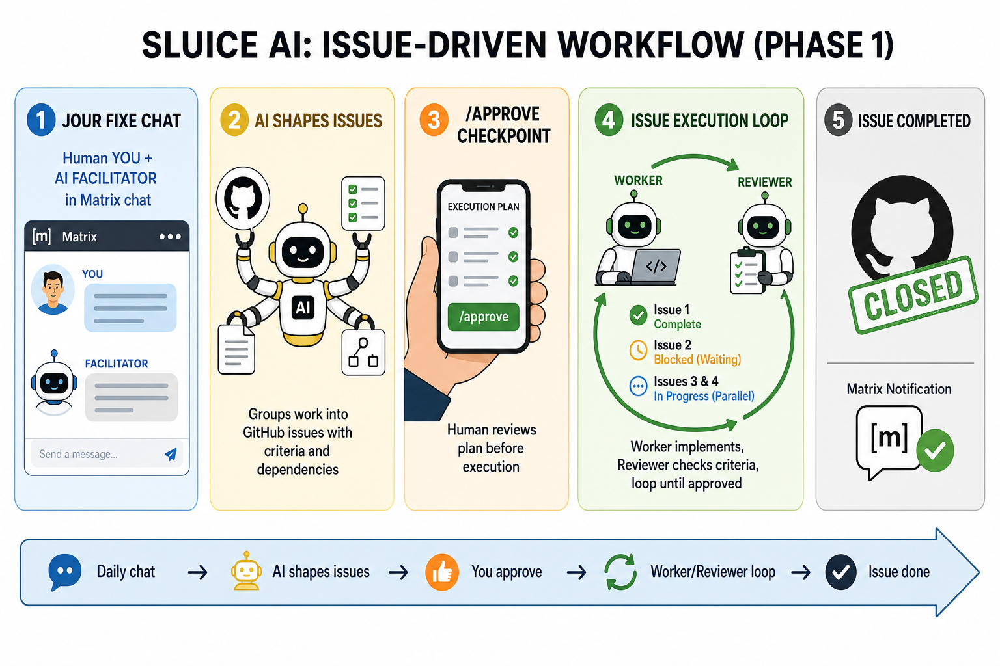

# Sluice

[](https://github.com/alexseymer/sluice/actions/workflows/ci.yml)
[](https://github.com/alexseymer/sluice/actions/workflows/docker.yml)
[](https://www.python.org/downloads/)
[](https://opensource.org/licenses/MIT)
[](https://github.com/alexseymer/sluice/pkgs/container/sluice)

**Sluice** paces your AI coding CLI usage (Claude Code, Codex, Cursor, Agy, and others) across the day so you stay under subscription rate limits — instead of bursting through your quota in one session and getting silently downgraded to a weaker fallback model, or paying overage rates on metered API billing.

You talk to Sluice once a day (or on whatever cadence you set) in a short **jour fixe** — a chat session where you discuss what needs doing. Sluice turns that into a dependency-ordered plan, files it as issues on your Git forge of choice (GitHub today; GitLab and OneDev planned), and works through the backlog throughout the day, scheduling AI CLI calls to stay within each tool's budget. You get pinged with status, blockers, and anything that needs a decision — over Matrix today (Signal and Telegram planned), all privacy-first.

## Status

**Phase 1 is complete** and runnable via **Docker Compose**. The full loop works: cron-triggered jour fixe → conversational planning → `/approve` to file GitHub issues → background dispatch with dependency ordering → budget pacing and backend failover → forge sync when issues close.

| Component | Status |
|-----------|--------|
| Matrix chat + jour fixe commands | ✅ |
| Conversational jour fixe (subscription CLIs) | ✅ |
| Docker CLI install + Matrix login (`/cli-auth`) | ✅ |
| Orchestrator issue shaping + worker/reviewer loop | ✅ |
| GitHub issues + dependency links | ✅ |
| AI backends (Claude Code, Cursor, Agy, Codex) | ✅ |
| Budget probing + fallback failover | ✅ |
| Interactive `sluice setup` wizard | ✅ |
| Signal / Telegram / GitLab / OneDev | 🔜 planned |

See [`docs/prd.md`](docs/prd.md) for the product spec and [`ROADMAP.md`](ROADMAP.md) for what's next.

## Why

AI coding subscriptions have usage windows. Burn through them in a burst and you either get downgraded to a weaker model without much warning, or start paying metered rates. Sluice treats "AI coding capacity" as a schedulable, rate-limited resource — like a build farm schedules CI jobs — so you get consistent throughput without babysitting it.

## How it works

Sluice is **issue-driven**: GitHub issues are the backbone of the plan. A daily jour fixe chat becomes shaped issues, you approve before anything runs, then worker and reviewer CLI agents execute each issue in dependency order.



**Daily chat → AI shapes issues → You approve → Worker/Reviewer loop → Issue done**

### 1. Jour fixe chat

You meet Sluice in Matrix on a schedule (or on demand with `/jour-fixe`). A **facilitator** — your configured AI coding CLI (subscription) — helps you talk through status quo, problems, and how to handle them. This is planning conversation, not execution.

In Docker, Sluice installs the Linux CLIs listed in `SLUICE_AI_BACKENDS` on startup (into `/data/home`) and posts login links to Matrix. For Cursor, open the link; for `agy`, open the link and reply with the verification code. Say `/cli-auth` to retry.

### 2. AI shapes issues

When you say you're done, the **orchestrator** (primary CLI agent) reads the full transcript and shapes it into GitHub-ready issues:

- Groups related work into one issue when it ships together (not one micro-issue per bullet)
- Splits only when work is genuinely independent
- Writes **acceptance criteria** so a reviewer can verify completion
- Sets **dependency links** — what must finish before what, and what can run in parallel

Sluice posts the shaped plan in Matrix for your review (`/plan` to see it again).

### 3. `/approve` checkpoint

Nothing is filed or executed until you reply **`/approve`**. Use **`/reject`** to discard and start over. This gate keeps the orchestrator's shaped issues under human control before any specialist agents run.

### 4. Issue execution loop

On approval, issues are filed on GitHub. For each **ready** issue (all blockers completed):

1. **Worker** CLI agent implements the issue in an isolated worktree
2. **Reviewer** CLI agent checks the output against acceptance criteria
3. If review fails, the worker revises — loop until approved or `SLUICE_MAX_REVIEW_ITERATIONS`

**Sequential:** issue 2 stays blocked until issue 1 is complete and passes review.

**Parallel:** independent issues (e.g. 3 and 4 with the same blockers but not depending on each other) dispatch concurrently.

Sluice paces dispatches across backends to stay within subscription budgets and fails over when quota or fallback-model degradation is detected.

### 5. Issue completed

When an issue passes review, Sluice marks it complete and closes the GitHub issue. You get a notification in Matrix. Forge sync also picks up issues closed manually on GitHub.

Outside jour fixe, use `/status`, `/plan`, `/cli-auth`, and `/help` in Matrix.

### Configuration

| Variable | Role |
|----------|------|
| `SLUICE_AI_BACKENDS` | CLIs to install/auth and the worker pool |
| `SLUICE_ORCHESTRATOR_BACKEND` | Primary agent that shapes issues (defaults to `SLUICE_PLANNER_BACKEND`) |
| `SLUICE_REVIEWER_BACKEND` | Second agent for per-issue review loops |
| `SLUICE_MAX_REVIEW_ITERATIONS` | Max worker/reviewer cycles per issue (default `3`) |
| `SLUICE_CLI_BOOTSTRAP_ENABLED` | Install + Matrix-auth CLIs on daemon start |

Without `SLUICE_REVIEWER_BACKEND`, Sluice falls back to single-agent dispatch per issue.

## Privacy

Sluice is privacy-first by design on the chat layer specifically — no third-party SaaS relay of your conversations, self-hostable end-to-end via Docker. See [`SECURITY.md`](SECURITY.md) for details and current caveats (e.g. Telegram's lack of E2E for bot chats).

## Getting started (Docker)

Sluice is meant to run as a container. The image is built on GitHub Actions and
published to GHCR (`ghcr.io/alexseymer/sluice`). Prefer pulling the published image;
for local image iteration use `docker compose build` then
`docker compose up -d --force-recreate --pull never`.

```bash
# 1. Create env file (secrets stay on the host, mounted into the container)
cp .env.example .env

# 2. If the package is private, log in once:
#    echo YOUR_GITHUB_TOKEN | docker login ghcr.io -u YOUR_GITHUB_USERNAME --password-stdin

# 3. Interactive setup (pulls the image, then runs the wizard)
docker compose run --rm sluice setup

# 4. Run the daemon
docker compose up -d

# Logs
docker compose logs -f sluice
```

After setup (or any `.env` change), recreate so Compose injects the new variables:

```bash
docker compose up -d --force-recreate
```

To refresh to the newest published image:

```bash
docker compose pull
docker compose up -d --force-recreate
```

`sluice setup` asks for minimal input (repo, a GitHub OAuth App client ID with Device Flow enabled, Matrix homeserver + your login, and ideally Synapse's `registration_shared_secret`). Existing `.env` values are offered as defaults; a still-valid GitHub token skips device login.

### Local development (optional)

For tests and hacking on the Python package without Docker:

```bash
pip install -e ".[dev]"
ruff check src tests
pytest
sluice setup   # same wizard; still writes .env
```

See [`AGENTS.md`](AGENTS.md) for project layout and agent notes.

## License

MIT — see [`LICENSE`](LICENSE).
